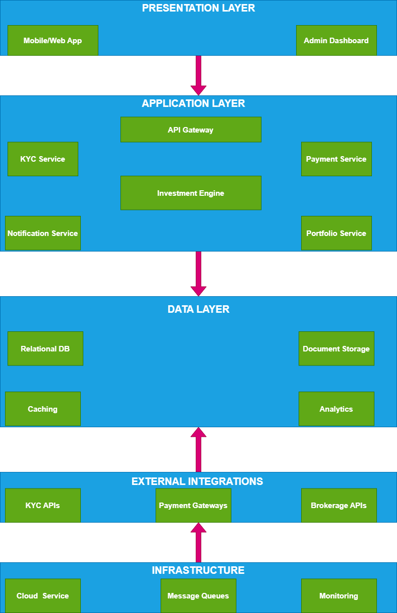

### **1. High-Level Architecture**  
The system follows a **layered microservices architecture** to decouple concerns and enable scalability. Key layers include:  

- **Presentation Layer**:  
  - **Mobile/Web App**: User interface for onboarding, deposits, portfolio viewing.  
  - **Admin Dashboard**: Compliance monitoring, audit logs, system health checks.  

- **Application Layer**:  
  - **API Gateway**: Routes requests, handles authentication, rate limiting.  
  - **KYC Service**: Manages identity verification and risk profiling.  
  - **Payment Service**: Processes deposits via bank transfers, cards, or mobile money.  
  - **Investment Engine**: Executes automated trades based on user risk profiles.  
  - **Portfolio Service**: Tracks holdings, balances, and performance.  

- **Data Layer**:  
  - **Relational Database**: Stores user profiles, transactions, KYC metadata.  
  - **Document Storage**: Securely stores KYC documents (e.g., IDs).  
  - **Caching (Redis)**: Caches market data and frequently accessed user data.  
  - **Analytics (Snowflake)**: Handles historical performance reporting.  

- **Infrastructure Layer**:  
  - **Cloud**: Hosts services with auto-scaling and redundancy.  
  - **Message Queues**: Manages async workflows (e.g., payment → investment).  
  - **Monitoring**: Tracks latency, errors, and uptime.  

- **External Integrations**:  
  - **KYC APIs**   
  - **Payment Gateways** 
  - **Brokerage APIs** 
  
The image is shown below:

---

### **2. Key Components & Responsibilities**  
| **Component**          | **Responsibilities**                                                                 |  
|-------------------------|-------------------------------------------------------------------------------------|  
| **User Service**        | Manages user registration, authentication, and profile updates.                     |  
| **KYC Service**         | Handles document OCR, liveness checks, and government API verification.             |  
| **Payment Service**     | Processes deposits via multiple gateways; ensures idempotency and retries.           |  
| **Investment Engine**   | Applies risk-based strategies, executes trades via brokerage APIs, rebalances portfolios. |  
| **Portfolio Service**   | Aggregates holdings, calculates real-time balances, and generates tax reports.      |  
| **Notification Service**| Sends alerts for transactions, portfolio changes, and compliance updates.           |  
| **Risk Management**     | Validates trades against user risk tolerance and regulatory limits.                  |  

---

### **3. Data Models**  
#### **Core Entities**:  
1. **User**  
   - `user_id (PK)`, `email`, `password_hash`, `risk_profile`, `KYC_status`.  

2. **Account**  
   - `account_id (PK)`, `user_id (FK)`, `balance`, `currency`.  

3. **Transaction**  
   - `transaction_id (PK)`, `account_id (FK)`, `type` (deposit/trade), `amount`, `timestamp`, `status`.  

4. **Portfolio**  
   - `portfolio_id (PK)`, `user_id (FK)`, `asset_id` (e.g., stock ticker), `quantity`, `purchase_price`.  

5. **KYC Document**  
   - `doc_id (PK)`, `user_id (FK)`, `document_type` (ID/passport), `s3_url`, `verification_status`.  

6. **Asset**  
   - `asset_id (PK)`, `symbol`, `name`, `type` (stock/bond), `current_price`.  

---

### **4. Technology Choices & Justifications**  
| **Technology**                      | **Use Case**                                         | **Justification**                                                                                                                                                                                         |
|-------------------------------------|------------------------------------------------------|-----------------------------------------------------------------------------------------------------------------------------------------------------------------------------------------------------------|
| **Node.js**                         | KYC Service, Payment Service, API Gateway            | Non‑blocking I/O for high‑concurrency KYC/verification calls; vast NPM ecosystem (OCR, ID‑verification, OAuth libraries); JavaScript across stack for consistency.                                       |
| **Spring Boot**                     | Investment Engine, Portfolio Service, Reporting      | Enterprise‑grade transaction management (ACID & sagas); Spring Security and Actuator for security & monitoring; mature ecosystem for financial workflows.                                                |
| **PostgreSQL**                      | Relational data: user profiles, transactions, KYC logs | ACID compliance for financial integrity; JSONB for semi‑structured KYC metadata; replication, PITR, and row‑level security for compliance.                                                                |
| **Redis**                           | Caching: market quotes, session tokens, portfolio snapshots | In‑memory store for sub‑millisecond reads; Pub/Sub and TTL features for expiring holds and live data feeds; simple clustering for high availability.                                                      |
| **Kafka**                           | Async event streaming (payment → investment workflows) | High‑throughput, durable messaging with at‑least‑once delivery; partitioning for scale and event‑sourcing support; outbox pattern integration for distributed consistency.                                 |
| **AWS / GCP**                       | Cloud infra: compute (K8s/EKS/GKE), storage, managed DBs | Managed services (RDS, MSK, S3/Cloud Storage) reduce ops overhead; auto‑scaling and multi‑AZ/region failover; built‑in compliance certifications (ISO 27001, SOC 2, PCI DSS).                             |
| **Stripe / M‑Pesa**                 | Card payments & mobile‑money adapters                | PCI DSS certified; event‑driven integration; global reach with region‑specific methods; built‑in retry logic and dispute handling.                                                                         |
| **Prometheus / Grafana**            | Monitoring & alerting                                | Pull‑based metrics collection ideal for Kubernetes; flexible querying (PromQL) and rich dashboards; Alertmanager for on‑call notifications.                                                             |
| **React**                           | Web frontend (user onboarding, dashboard, admin UI)  | Component‑based for reuse across user/admin apps; fast updates with virtual DOM; SSR/SSG via Next.js for SEO and initial‑load performance.                                                                 |
| **Snowflake**                       | Analytics & historical reporting                     | Scales compute independently from storage; near‑unlimited concurrency for complex ad‑hoc queries; native support for semi‑structured data and time‑travel for audit.                                     |
| **Onfido / Jumio**                  | Identity verification (KYC/e‑KYC)                    | Pre‑built document and face‑match flows; global coverage and compliance with local regulations; real‑time results via secure APIs.                                                                        |
| **Alpaca / Interactive Brokers API**| Brokerage integration (trade execution)              | REST‑ and FIX‑based endpoints for placing and managing orders; sandbox environments for testing; webhook support for execution reports.                                                                     |
          |  

---

### **5. Non-Functional Requirements**  
#### **Security**:  
- **Data Encryption**: AES-256 for data at rest (S3), TLS 1.3 for data in transit.  
- **Authentication**: OAuth2/JWT with MFA for user and admin access.  
- **Compliance**: Regular audits, integration with AML tools (e.g., ComplyAdvantage).  

#### **Reliability**:  
- **Idempotent APIs**: Ensure no duplicate transactions (e.g., payment retries).  
- **Database Backups**: Daily snapshots with point-in-time recovery (AWS RDS).  
- **Circuit Breakers**: Halt trading during market volatility or system overload.  

#### **Scalability**:  
- **Horizontal Scaling**: Auto-scaling groups for payment and investment services.  
- **Database Sharding**: Split user data by region (e.g., `user_id` ranges).  
- **Caching**: Redis reduces read load on PostgreSQL during peak traffic.  

---

### **6. Failure Points & Mitigation**  
| **Failure Scenario**         | **Mitigation Strategy**                                                                 |  
|-------------------------------|-----------------------------------------------------------------------------------------|  
| **Payment Gateway Downtime**  | Retry with exponential backoff; fallback to alternate gateways (e.g., Stripe → Adyen).  |  
| **KYC Verification Failure**  | Notify user with rejection reason; allow document re-upload.                            |  
| **Trade Execution Error**     | Dead-letter queues (Kafka) for manual reprocessing; idempotency keys to avoid duplicates.|  
| **Database Outage**           | Multi-AZ deployment with failover; restore from backups.                                |  
| **Market Data Feed Delay**    | Cache recent prices in Redis; use stale data with user warnings.                        |  

---
